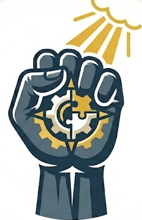

<p align="center">
  
</p>

<h1 align="center">환불원정대</h1>

<p align="center">
  <strong>억울한 위약금, AI와 변호사가 함께 바로잡아 드립니다</strong>
</p>

<p align="center">
  <a href="https://refund-weld.vercel.app">🌐 서비스 바로가기</a>
</p>

---

## 📖 서비스 소개

**환불원정대**는 부당한 위약금으로 고통받는 소비자를 위한 **AI 기반 소비자 분쟁 진단 서비스**입니다.

소비자가 겪고 있는 분쟁 상황을 입력하면, AI가 **소비자분쟁해결기준**과 **관련 법령·판례**를 자동으로 검토하여 **기초 법률 진단서**를 생성합니다. 이 진단서를 바탕으로 전문 변호사에게 바로 상담을 신청할 수 있는 원스톱 서비스입니다.

### 💡 왜 만들었나요?

- 많은 소비자가 업체의 과도한 위약금 요구에 제대로 대응하지 못합니다.
- 법률 상담의 문턱이 높아 포기하는 경우가 많습니다.
- **소비자분쟁해결기준**이라는 강력한 법적 근거가 있지만, 일반인이 이를 찾아 적용하기 어렵습니다.

**환불원정대**는 AI가 이 과정을 자동화하여, 누구나 자신의 법적 권리를 쉽게 확인하고 전문가 도움을 받을 수 있도록 합니다.

---

## ✨ 핵심 기능

### 1. 🏷️ 15개 분쟁 카테고리 지원

| 카테고리 | 적용 법률 기준 |
|---------|--------------|
| 🏋️ 헬스장 / PT | 방문판매법 제29조, 소비자분쟁해결기준 (체육시설업) |
| 💒 예식장 | 소비자분쟁해결기준 (예식서비스업) |
| ✈️ 숙박 / 항공권 | 소비자분쟁해결기준 (숙박업/항공) |
| 🩺 의료 / 성형외과 | 의료법 제27조, 소비자기본법 제16조 |
| 📚 학원 / 온라인 강의 | 학원법 제18조, 전자상거래법 |
| 🚗 중고차 매매 | 자동차관리법 제58조, 민법 제580조 |
| 🛠️ 자동차 수리 | 소비자분쟁해결기준 (정비업) |
| 📦 이사 화물 | 소비자분쟁해결기준 (이사화물운송업) |
| 🚚 택배 / 배송 | 상법 제135조~제146조 |
| 💅 미용실 / 네일샵 | 소비자분쟁해결기준 (이·미용업), 공중위생관리법 |
| 🏠 인테리어 시공 | 건설산업기본법 제28조 |
| 🎮 모바일 게임 결제 | 전자상거래법 제17조, 민법 제5조 |
| 🛒 전자상거래 / 직구 | 전자상거래법 |
| 👶 산후조리원 | 모자보건법, 소비자분쟁해결기준 (산후조리업) |
| ⚰️ 상조 서비스 | 할부거래에 관한 법률 제27조 |

> 💡 15개 카테고리에 포함되지 않는 분쟁도 **"기타 (직접 입력)"**으로 진단이 가능합니다.

### 2. ⚖️ AI 기초 법률 진단

- **소비자분쟁해결기준**을 절대적 기준으로 적용한 자동 분석
- 업체 요구 위약금 vs 법적 기준 위약금 **비교 계산**
- 법적 기준 초과 위약금 **자동 감지 및 경고**
- 적용 법령 조항 **자동 인용**
- 계약서/이용약관 첨부 시 AI가 내용을 읽고 **불공정 조항 식별**

### 3. 🔢 카테고리별 환불액 자동 계산

각 카테고리의 법적 기준에 맞는 정확한 환불액을 산출합니다:

- **헬스장/PT**: `환불금액 = 총 계약대금 - 이용료 - 위약금(최대 10%)`
- **예식장**: 예식일까지 남은 일수에 따른 단계별 위약금 적용
- **숙박/항공**: 이용 예정일 기준 시기별 차등 위약금
- **의료/성형**: 횟수제 잔여분 비례 환급, 사업자 귀책 시 위약금 면제
- **기타 카테고리**: 소비자분쟁해결기준 일반 원칙 (위약금 10% 이내)

### 4. 📋 전문 변호사 상담 연결

- AI 진단 결과를 기반으로 **변호사 상담 즉시 신청**
- 고객 정보 + AI 진단서 + 변호사용 리포트 **자동 통합 전달**
- 영업일 1~2일 이내 전문 상담 안내

### 5. 🎙️ 음성 입력 지원

- Web Speech API 기반 **한국어 음성 입력**
- 길고 복잡한 상황 설명을 말로 편하게 입력 가능

### 6. 📄 계약서/이용약관 분석

- PDF, 이미지(JPG, PNG, WebP) 파일 첨부 지원 (3MB 이하)
- 이용약관 URL 입력 시 자동 크롤링 및 분석
- 소비자분쟁해결기준보다 불리한 조항 **자동 식별**

---

## 🔄 사용 방법

### STEP 1 — 분쟁 유형 선택

15개 카테고리 중 해당하는 분쟁 유형을 선택하세요. 카테고리에 없는 경우 **"기타 (직접 입력)"**을 선택하면 됩니다.

### STEP 2 — 정보 입력

- **결제 금액**: 업체에 지불한 총 금액
- **이용 기간/횟수**: 계약 기간 또는 총 이용 횟수와 사용한 기간/횟수
- **업체 요구 위약금**: 업체가 요구하는 위약금 (또는 환불 거부 시 0원)
- **상황 설명**: 분쟁 상황을 자유롭게 서술 (음성 입력 가능 🎙️)
- **계약서 첨부** (선택): PDF/이미지 파일 첨부 또는 이용약관 URL 입력

### STEP 3 — AI 분석

AI가 입력된 정보를 바탕으로 **소비자분쟁해결기준**과 **관련 법령·판례**를 자동 검토합니다. 약 10~30초 소요됩니다.

### STEP 4 — 결과 확인 및 상담 신청

- **법적으로 보장되는 최소 환불액**과 **업체 요구 위약금**을 비교하여 확인
- 법적 기준을 초과하는 부당 위약금이 있으면 경고 표시
- 결과 하단의 **상담 신청 폼**에서 이름, 연락처를 입력하면 변호사에게 바로 전달

### STEP 5 — 접수 완료

상담 접수가 완료되면 영업일 1~2일 이내 안내를 받을 수 있습니다.

---

## 🔐 관리자 페이지

`/admin` 경로에서 관리자 비밀번호로 접속하여 접수 내역을 관리할 수 있습니다.

| 기능 | 설명 |
|------|------|
| **접수 내역 조회** | 전체 상담 접수 내역을 시간순으로 조회 |
| **상태 관리** | `작성 중` → `상담 요청됨` → `상담 완료`로 진행 상태 변경 |
| **변호사 리포트** | AI가 생성한 사건 분석 리포트 상세 확인 |
| **고객 정보** | 연락처, 이메일, 입력 원문 확인 |

---

## 🏗️ 기술 스택

| 영역 | 기술 |
|------|------|
| **프레임워크** | Next.js 15 (App Router) |
| **스타일링** | Tailwind CSS 4 |
| **AI 엔진** | Google Gemini 2.5 Flash |
| **법률 데이터** | korean-law-mcp (법제처 Open API 기반) |
| **데이터베이스** | Supabase (PostgreSQL) |
| **배포** | Vercel |
| **언어** | TypeScript |

---

## 🚀 개발 환경 설정

### 사전 요구사항

- Node.js 18 이상
- Supabase 프로젝트
- Google Gemini API 키

### 설치 및 실행

```bash
# 의존성 설치
npm install

# 환경변수 설정 (.env.local 파일에 필요한 키 값 입력)
cp .env.local.example .env.local

# 개발 서버 실행
npm run dev
```

### 배포

```bash
npx vercel --prod
```

---

## ⚖️ 법적 고지

> **이 서비스는 법률 자문을 제공하지 않습니다.**

- 환불원정대는 소비자분쟁해결기준을 바탕으로 **참고용 정보**를 제공하는 AI 서비스입니다.
- AI가 제공하는 진단 결과는 입력 정보에 기반한 **단순 가이드라인**이며, 법적 효력이 없습니다.
- 구체적인 법적 판단과 대응은 반드시 **법률 전문가와 상담**하시기 바랍니다.
- 서비스 이용 시 수집되는 개인정보는 상담 연결 목적으로만 사용되며, 수집일로부터 1년 후 자동 파기됩니다.

---

## 📄 라이선스

이 프로젝트는 비공개(Private) 프로젝트입니다.

---

<p align="center">
  <sub>© 2026 환불원정대. All rights reserved.</sub>
</p>
